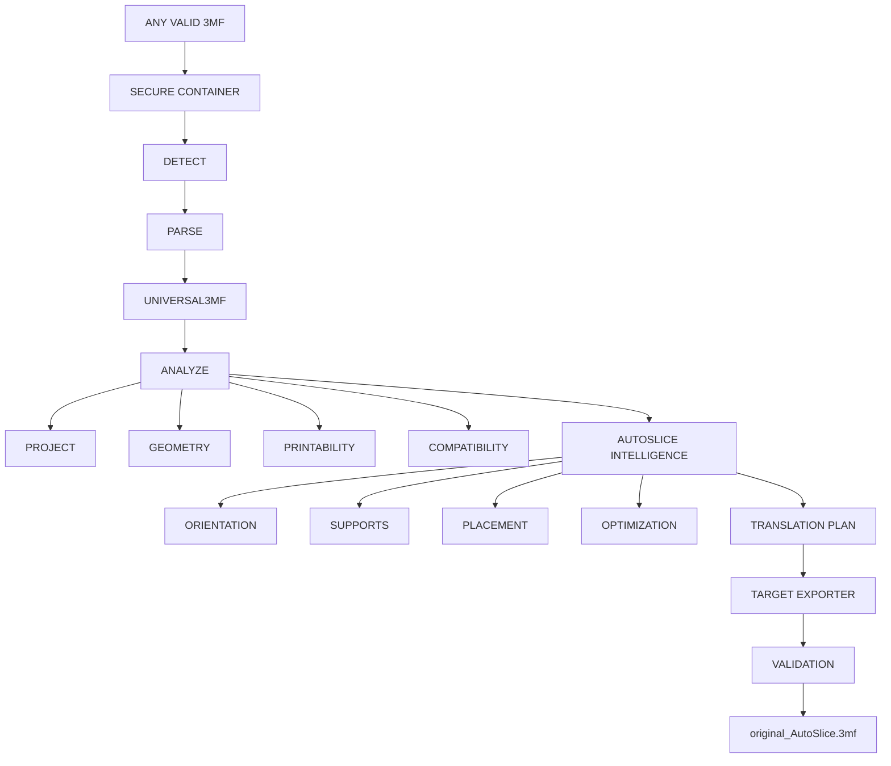

# AutoSlice production readiness

Audit date: 2026-08-23  
Application/API version: 1.5.63  
Release state: **BLOCKED pending real-fixture certification**

The engine, security gates, synthetic acceptance suite and user interface are operational. The Universal3MF flag remains off by default because the repository does not contain the real Bambu, Anycubic, Orca, Prusa or Cura acceptance fixtures referenced by 26 explicitly skipped tests. This is the required release gate; it must not be bypassed by treating generated fixtures as vendor certification.

## Final architecture

The secure outer conversion service owns bounded input, detection confidence, target selection, output naming, export, reparse validation and timings. The inner pipeline owns project, geometry, printability, orientation, support, placement, optimization and translation planning. Frontend code renders API contracts and does not reproduce those decisions.

## Production checklist

| Area | Status | Evidence / action |
|---|---|---|
| Security | Pass with rollout gate | Bounded ZIP/XML/OPC container; traversal, symlink, encryption, duplicate, entry count, expansion and ratio checks; streamed-size enforcement; dependency audits at zero known findings. |
| Tests | Blocked | 304 passed; 26 explicitly skipped because required real vendor fixtures are absent. |
| Performance | Pass for current timeout | Small through 10k-triangle synthetic cases complete below the 120s conversion timeout. |
| API | Pass | OpenAPI operations are unique; job routes authenticate and enforce ownership; useful bounded errors without stack responses. |
| Frontend | Pass | TypeScript, 7 UI flow tests, production Next.js build and npm audit pass. |
| Storage | Pass | UUID-isolated workspaces, canonical `source.3mf`, exclusive creation, 24h startup cleanup, collision-safe generated names. |
| Logging | Pass | Conversion IDs and aggregate timings only; filenames, email addresses, verification codes, reset links and secrets are not logged by changed release paths. |
| Monitoring | Limited | Structured conversion stages/timings and healthcheck exist; no metrics backend or distributed tracing. |
| Fallback | Pass | Legacy route remains available and defaults on; UI clearly marks legacy output. |
| Rollback | Pass | Set `USE_UNIVERSAL_3MF_ENGINE=false` and `UNIVERSAL_3MF_LEGACY_FALLBACK=true`, redeploy/restart, then verify `/health`. No data migration is needed. |

## Security controls

### ZIP, XML and OPC

- Upload extension and ZIP signature are checked.
- The actual streamed byte count is capped at 200 MiB; `UploadFile.size` is not trusted as the sole control.
- Container defaults cap files at 2,000, a part at 256 MiB, expanded data at 512 MiB and compression ratio at 200:1.
- Absolute paths, `..`, backslashes, NUL, drive prefixes, symlinks, encrypted entries and duplicate members are rejected.
- Legacy extraction uses the same bounded container and writes only beneath the resolved job workspace; raw `ZipFile.extractall` is no longer used.
- XML parts are capped at 32 MiB and reject DTD/entity declarations.
- External OPC relationships are rejected and the primary model must be reachable inside the package.

### Filesystem, uploads and downloads

- Client filenames are display metadata only; on disk the archive is always `source.3mf` below a random UUID directory.
- Non-UUID job identifiers and traversal strings do not resolve.
- Partial over-limit uploads are deleted.
- Job routes resolve only uploads owned by the authenticated user. Unauthorized and cross-owner lookups return no job.
- Universal download references are random, owner-scoped and revalidated immediately before delivery.
- Anycubic adapter temporary directories use OS-generated isolated workspaces and context-managed cleanup.
- Stale UUID job workspaces are removed at startup after 24 hours. Community storage is deliberately excluded.

### Time, memory and concurrency

- Universal analysis timeout: 60 seconds.
- Universal conversion timeout: 120 seconds.
- Next.js proxy timeout: 130 seconds.
- Proxy request and response bodies stream rather than creating full `ArrayBuffer` copies.
- Eight simultaneous synthetic conversions produced eight unique IDs and byte-identical deterministic outputs.
- Conversion output uses exclusive file creation; filename selection accounts for existing `.3mf` files.

Python worker threads cannot be force-killed safely when `asyncio.wait_for` expires. A timed-out thread can finish CPU work in the background, but cannot publish an API output. Process-level worker quotas remain an operational deployment responsibility.

## Capability matrix

| Capability | State | Notes |
|---|---|---|
| Secure 3MF container | Supported | Bounded non-extracting parser plus hardened legacy extraction. |
| Source detection | Supported with confidence gate | Unknown and low-confidence inputs stop safely. |
| Universal semantic model | Supported | Objects, build items, resources, process data and opaque preservation. |
| Geometry/printability | Supported with limits | Bounding/mesh heuristics; not a manufacturing simulation. |
| Orientation | Supported with limits | Deterministic candidate scoring. |
| Support planning | Supported with limits | Regions and strategies; no full commercial support-mesh generator. |
| Placement | Supported with limits | Deterministic grid/row/shelf/bounding-box heuristics. |
| Optimization | Supported with limits | Measurable deterministic objectives and hard limits; no ML. |
| Preserve mode | Supported | Source semantic/opaque data is retained where possible. |
| Analyze-only | Supported | No document mutations or export. |
| Anycubic export | Supported by synthetic acceptance | Native writable production adapter and target validation. |
| Other target exporters | Unsupported | No production-writable registry entries. |
| Live progress streaming | Unsupported | Stage timings are returned on completion. |
| Multi-process download registry | Unsupported | Download ownership records are process-local. |

## Supported conversion matrix

| Source | Detect/parse | Target Anycubic | Certification |
|---|---|---|---|
| Bambu Studio | Implemented | Implemented | Synthetic pass; real fixture missing — blocked for universal default-on. |
| OrcaSlicer | Implemented | Implemented | Synthetic pass; real conversion fixture missing — experimental. |
| PrusaSlicer | Implemented | Implemented | Synthetic pass; real conversion fixture missing — experimental. |
| Cura | Implemented | Implemented | Synthetic pass; real conversion fixture missing — experimental. |
| Anycubic | Implemented | Implemented | Synthetic round-trip pass; real fixture missing. |
| Core/generic 3MF | Parsed as fallback | Requires confident supported source identity | Unknown source identity is rejected by production conversion. |
| Unknown/malformed | Rejected | No output | Safe failure. |

Only Anycubic is a registered writable target. “ONE FILE. ANY SLICE.” describes the product workflow, not a claim that every proprietary 3MF extension or target slicer is certified.

## Performance benchmark

Windows x64, CPython 3.12.14, three runs per synthetic case, median elapsed time and maximum `tracemalloc` Python peak:

| Case | Triangles | Objects | Materials | Median | Peak Python memory |
|---|---:|---:|---:|---:|---:|
| Small | 12 | 1 | 1 | 46.59 ms | 0.56 MiB |
| Medium | 1,000 | 1 | 1 | 1,414.51 ms | 6.51 MiB |
| Large | 10,000 | 1 | 1 | 14,981.19 ms | 56.10 MiB |
| Multicolor | 1,000 | 1 | 4 | 1,699.96 ms | 5.87 MiB |
| Multi-object | 1,000 | 8 | 1 | 1,551.47 ms | 5.78 MiB |

The measured curve is dominated by mesh/geometry processing and scales approximately with triangle count in this dataset. No isolated regression justified a rewrite. `tracemalloc` adds instrumentation overhead, so values are comparative release baselines rather than service-capacity guarantees.

## Release gate and rollback

Before enabling Universal3MF by default:

1. Add licensed/sanitized real fixtures named by the skipped acceptance tests.
2. Run the complete suite with zero unexpected skips and certify each advertised source-to-Anycubic path.
3. Repeat npm and Python dependency audits, frontend production build, concurrency test and benchmark.
4. Set `USE_UNIVERSAL_3MF_ENGINE=true`; keep `UNIVERSAL_3MF_LEGACY_FALLBACK=true` for the first production rollout.
5. Monitor failure codes, duration percentiles, output validation failures, workspace growth and timeout rates.

Rollback is flag-only: disable Universal3MF, retain legacy fallback, restart instances. The change does not require a database rollback.

## Known limitations

- Real vendor-fixture certification is incomplete and blocks release/default-on.
- Only Anycubic output is writable.
- Timeout cancellation does not terminate already-running Python thread work.
- Download records are in process memory and do not survive restart or load-balance across instances.
- Startup cleanup is retention-based; there is no scheduled cleanup during a long-lived process.
- No enforced per-user conversion concurrency quota or global memory budget exists.
- Metrics, alerting and distributed tracing are not implemented.
- Support meshes, packing and orientation use deterministic heuristics rather than full commercial slicer algorithms.

## Final release decision

**BLOCKED.** Security and synthetic runtime gates are green, but the Universal engine must remain default-off until the explicitly missing real acceptance fixtures pass. No production release commit or push may be created from this audit state.
